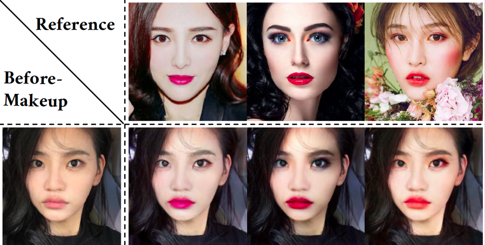
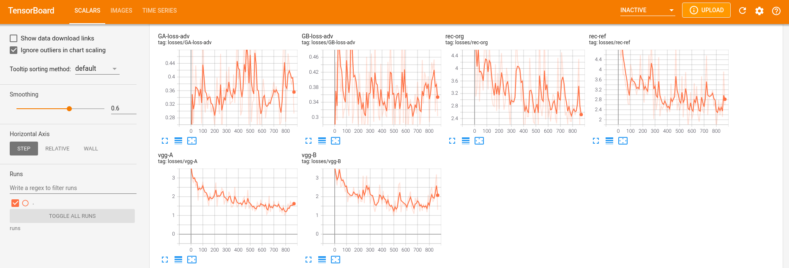
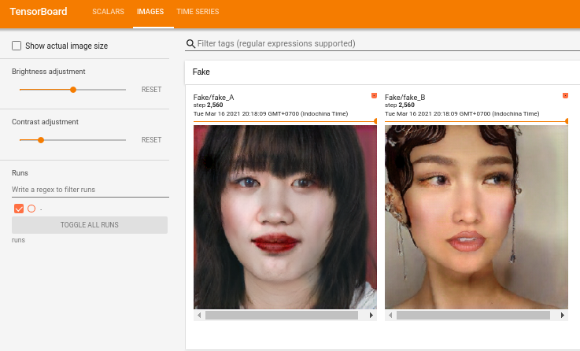

# BeautyGAN

BeautyGAN: Instance-level Facial Makeup Transfer with Deep Generative Adversarial Network

|  | 
|:--:| 
| *This image is from [BeautyGAN](liusi-group.com/pdf/BeautyGAN-camera-ready_2.pdf)* |

---

This is a modification of [Offical Pytorch code](https://github.com/wtjiang98/BeautyGAN_pytorch) for [BeautyGAN](liusi-group.com/pdf/BeautyGAN-camera-ready_2.pdf). The main differences are:

- Dataloaders
- Identities Loss (VGG)
- Add Tensorboard

Feel free to send me [pull requests](https://github.com/thaoshibe/awesome-makeup-transfer/pulls) (or [issues](https://github.com/thaoshibe/awesome-makeup-transfer/issues))

---

### Requirements

Install all required python packages:

- Via **pip**: `pip install -r requirements.txt`
- Via **conda**: `conda env create -f environment.yml` (then `conda activate beautygan`)

---

### Datasets

Please download the [Makeup Transfer Dataset](http://liusi-group.com/projects/BeautyGAN).

### Training Code

`python train.py --data_path /path/to/dataset`

For example: I downloaded Makeup Transfer Dataset to /home/ubuntu/makeup_dataset/. So the command will be `python train.py --data_path /home/ubuntu/makeup_dataset/`

- For Tensorboard: `tensorboard --logdir runs`, then open `http://localhost:6006/`

---

##### Tensorboard Snapshot

Tensorboard captured at **epoch 0**. The results are unpleasant at this time. Don't worry. To get the final model, I trained the model until epoch 200 (about 1 week in RTX 1080Ti)

|  | 
|:--:| 
| *Tensorboard Loss* |
|  |
| *Tensorboard Image*. First rows are fake images (results). Second are original images (inputs). Third are recycle images (reconstructed images)|

